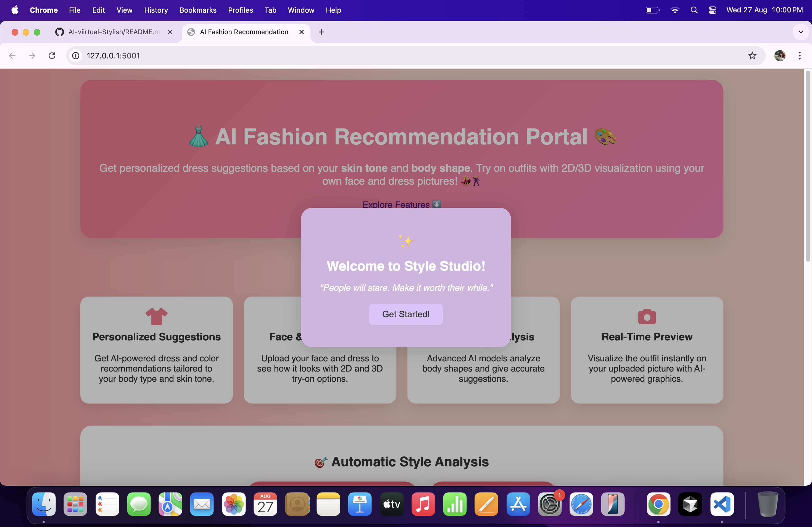
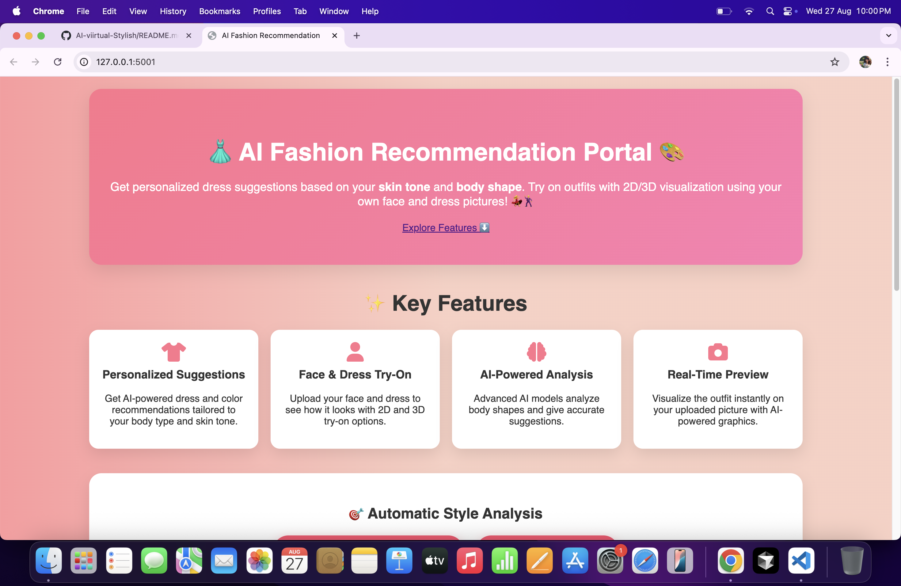
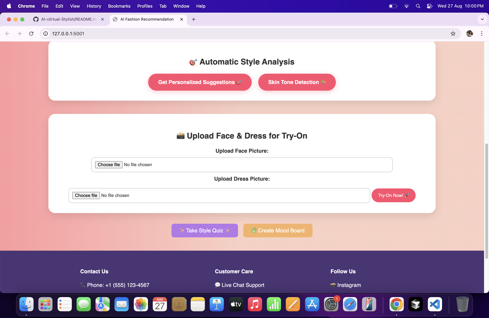
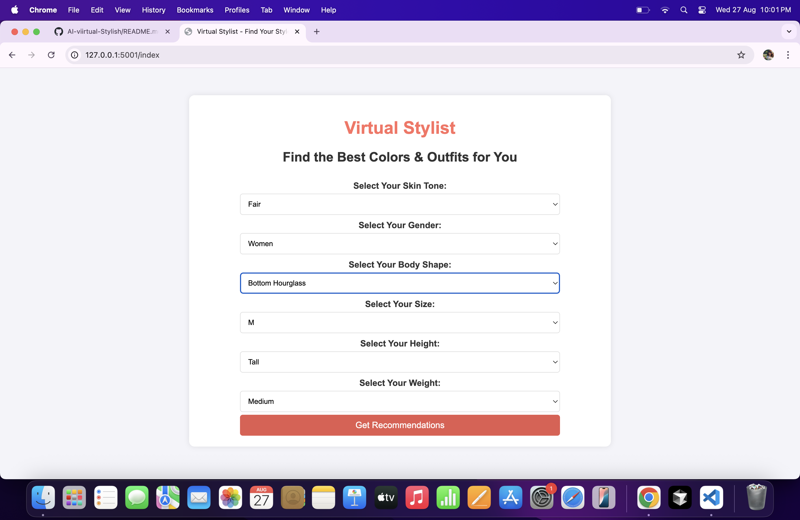
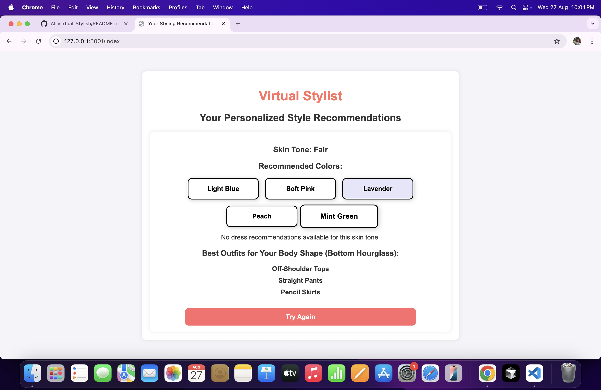
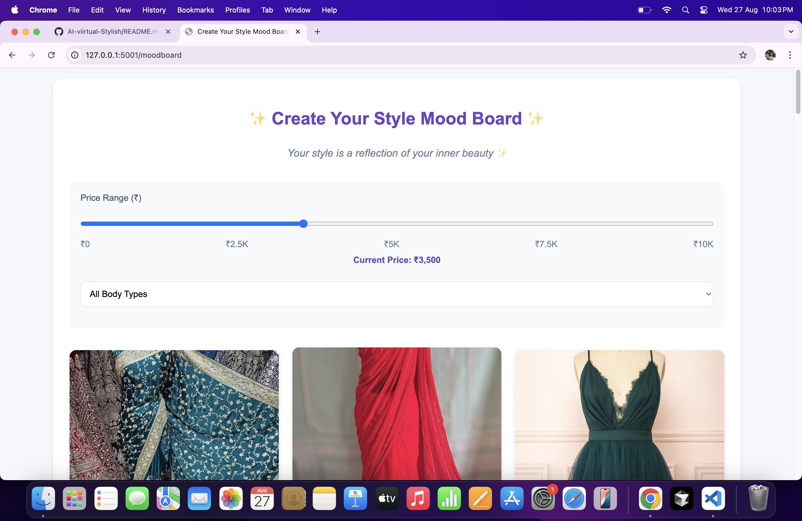
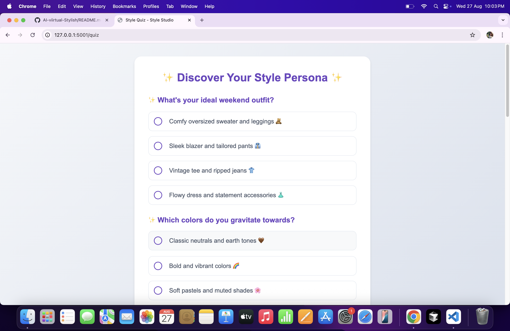
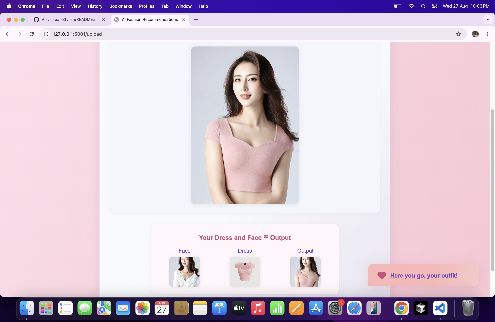
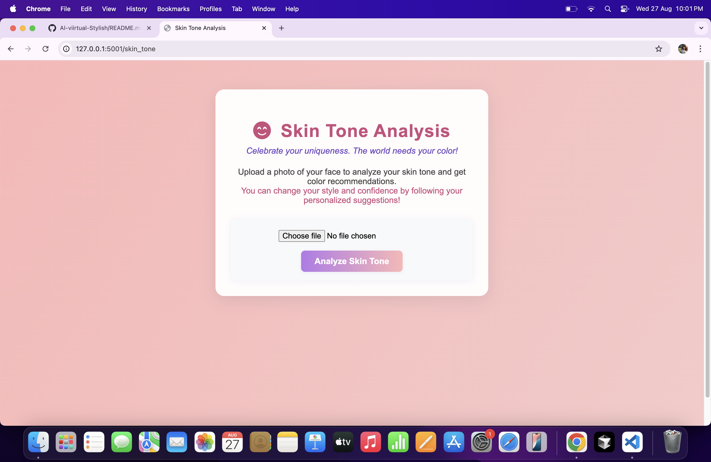
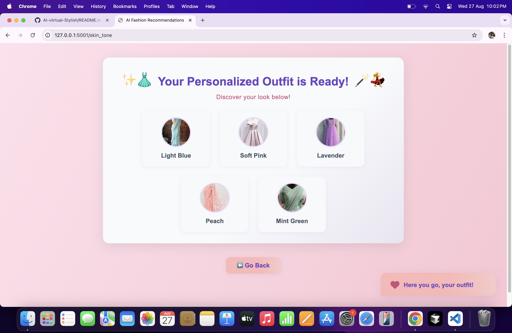

# Fashion-Portal# AI-virtual-Stylish
# 👗 AI Virtual Stylist

The **AI Virtual Stylist** is an intelligent fashion assistant that helps users discover and visualize outfits tailored to their **skin tone, mood, and personal style**.  
All features are functional except **2D outfit visualization**, which is still under development.

---

## ✨ Features

- 🎨 **Skin Tone Detection**  
  Detects user’s skin tone from uploaded photos to suggest matching outfits. ✅

- 👕 **2D Outfit Visualization (Under Development)**  
  Users will be able to upload an image and visualize a dress overlay.  
  _(Currently in progress – basic framework exists, but not fully functional.)_ ❌

- 🧩 **Style Quiz**  
  Fun quiz that captures preferences (casual, chic, formal, etc.) and generates outfit recommendations. ✅

- 📌 **Mood Board**  
  Create mood boards with curated inspirations. ✅

- 🤖 **Personalized Suggestions**  
  AI-based recommendations combining quiz answers, skin tone, and mood. ✅

---

## 🛠️ Tech Stack

- **Frontend**: HTML, CSS (soft pastel theme with animations)  
- **Backend**: Flask (Python)  
- **AI/ML**:  
  - OpenCV (for outfit visualization – WIP)  
  - Custom models for skin tone detection + recommendations  
- **Database**: SQLite for storing user profiles & quiz results  

---

## 🚧 Current Status

✅ Skin tone detection working  
✅ Style quiz working  
✅ Mood board functional  
✅ Personalized outfit recommendations ready  
⚠️ 2D visualization of outfits → **still under development**  

---

## 📌 Roadmap

- [ ] Complete 2D visualization feature  
- [ ] Add **3D try-on** support  
- [ ] Expand outfit dataset for better recommendations  
- [ ] Improve skin tone detection accuracy  
- [ ] Seasonal & trending outfit recommendations  
- [ ] Deploy to Render / GitHub Pages  

---

## 🚀 Getting Started
## 🖼️ Website Preview

### 🌸 Starting Page


### 🏠 Home Page


### 📌 Home Page (Continuation)


### 🎯 Personalized Suggestions


### ✅ Suggestions Output


### 🎨 Mood Board


### 📝 Style Quiz


### 👗 2D Preview (Under Development)


### 🎨 Skin Tone Detection


### ✅ Skin Tone Output



### Prerequisites
- Python 3.9+  
- Flask  
- OpenCV  

### Installation
```bash
git clone https://github.com/Samyu18/AI-virtual-Stylish.git
cd AI-virtual-Stylish
pip install -r requirements.txt
## License

This project is licensed under the **MIT License**.  

You are free to:

- Use, copy, modify, merge, publish, distribute, sublicense, and/or sell copies of the software.  

Conditions:

- Include the original copyright and license notice in all copies or substantial portions of the software.  

For full details, see the [LICENSE](LICENSE) file.
